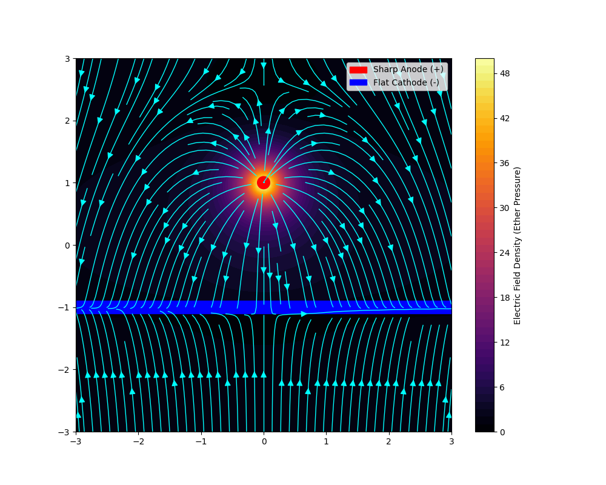
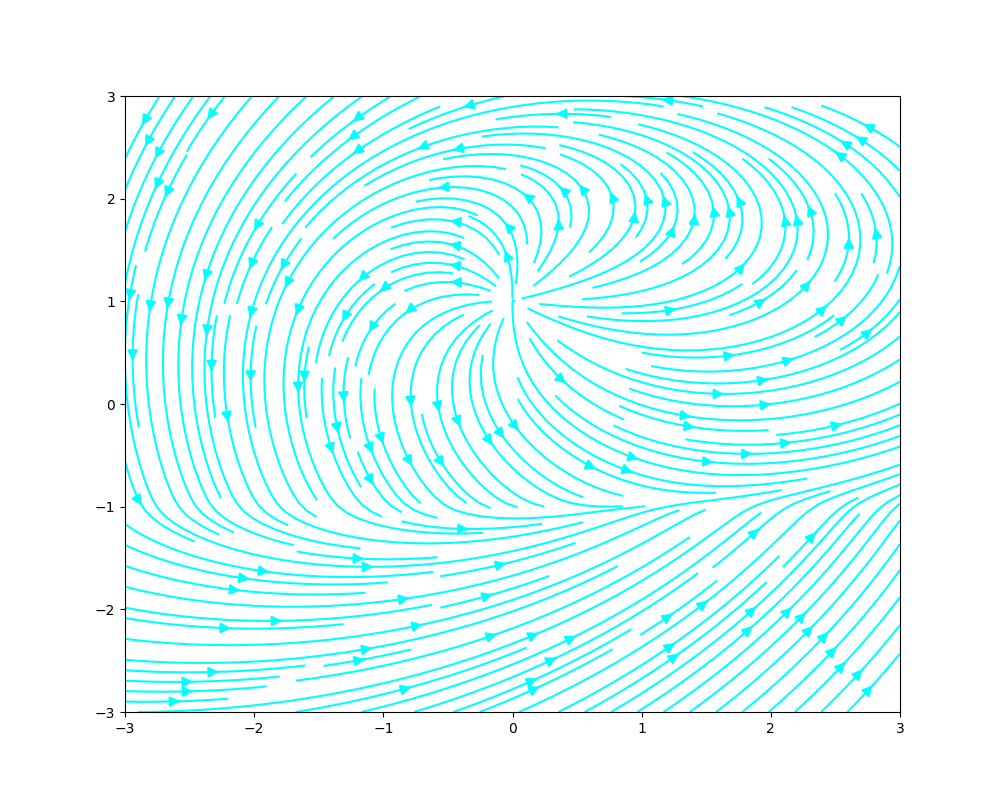
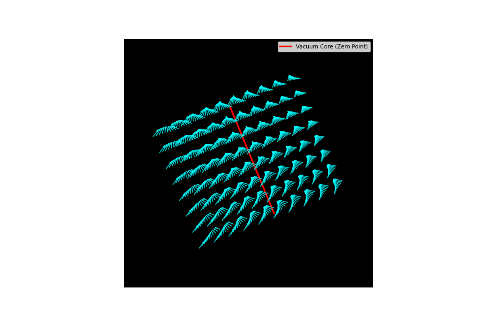

# Dielectric Vortex Engine (DVE) Simulation

 

**A computational exploration of longitudinal lift generation via asymmetrical torsion fields.**

> *"Nature uses implosion, not explosion."* — Viktor Schauberger

## 📄 Abstract
Standard propulsion relies on the expansion of gases (Explosion). This project simulates an alternative topological mechanism: **Implosion**. By modeling a high-voltage dielectric medium subjected to magnetic torsion, we demonstrate the formation of a **Hyperbolic Vortex**—a self-organizing geometry that creates a central vacuum node, theoretically allowing for propellant-less propulsion via the Biefeld-Brown effect.

[Read Research Paper (PDF)](paper/Dielectric_Vortex_Lift.pdf)

## 🔬 The Findings

### 1. The Geometry of Implosion
Unlike a static electric field which creates a "wall" of pressure, a rotating field creates a "funnel."

| Static Asymmetry (Standard) | Dynamic Torsion (Ours) |
| :---: | :---: |
|  |  |
| *Linear drag. High impedance.* | *Curved flow. Low impedance.* |

### 2. The Etheric Screw
Our 3D simulation reveals that the field forms a coherent helical tube. This topology acts as an "Archimedes Screw" for the ether, generating lift by pulling the craft into the vacuum core rather than pushing against the air.

## ⚠️ Disclaimer
This is a computational physics simulation exploring theoretical field topologies. It does not claim to violate the conservation of momentum but proposes an open-system interaction with the dielectric medium (ether).
